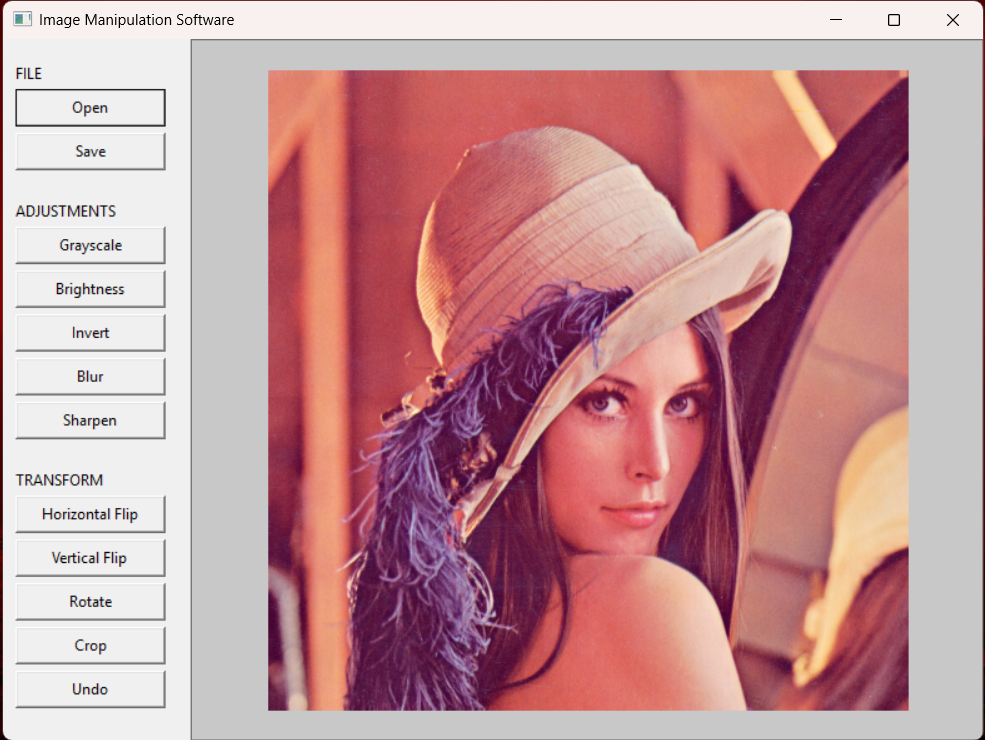
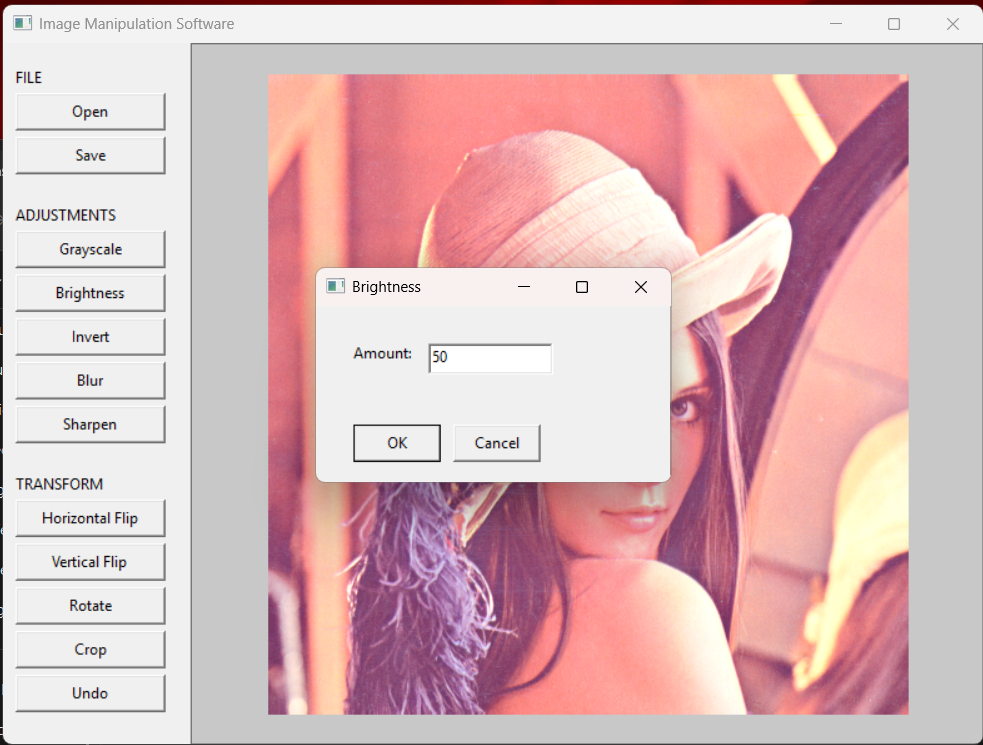
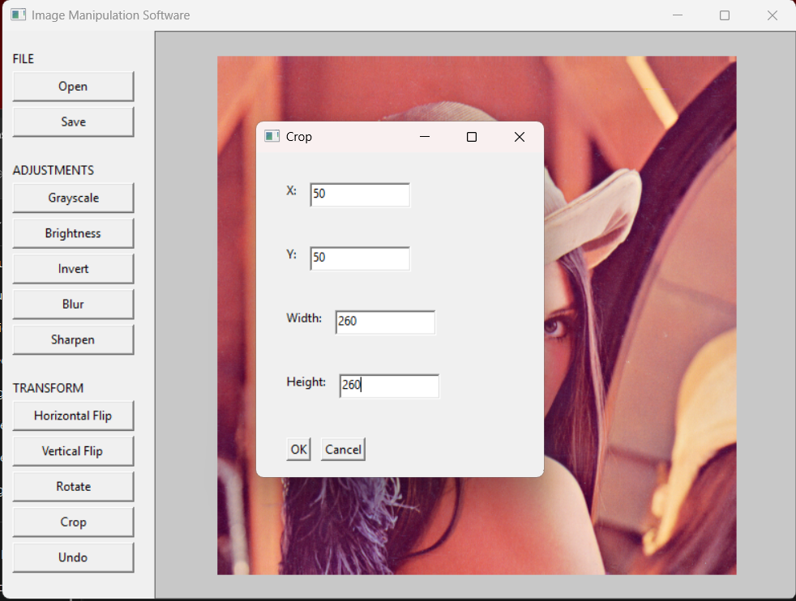
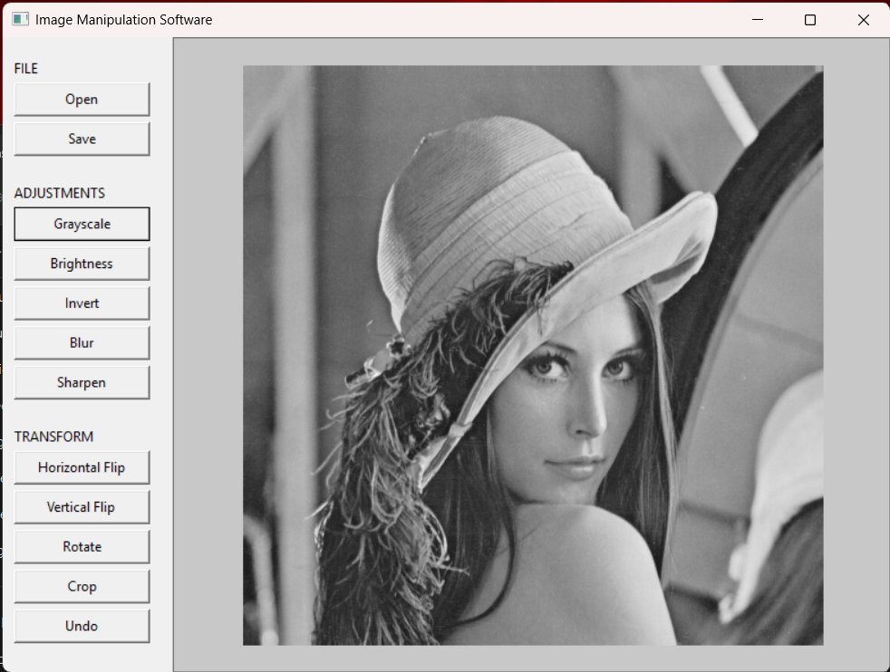

# 🖼️ Image Manipulation Software

A simple **24-bit uncompressed BMP** image manipulation program written in **C**, using the **IUP GUI toolkit**.

---

## ✨ Features

- Open 24-bit uncompressed BMP images
- Save images as BMP
- Grayscale
- Brightness adjustment
- Invert colors
- Horizontal flip
- Vertical flip
- Rotate
- Crop
- Blur
- Sharpen
- Undo
- Image information display
- GUI built with IUP

---

## Screenshots

### Main Interface

The main interface with a BMP image loaded into the application.



### Brightness Adjustment

The brightness adjustment dialog allows the user to enter a brightness value.



### Crop Image

The crop dialog allows the user to specify the position and dimensions of the area to crop.



### Grayscale Operation

An example of an image after applying the grayscale operation.



---

## 📁 Project Structure

```
Image Manipulation Software/
│
├── include/              # Header files
│   ├── bmp.h
│   ├── gui.h
│   ├── image.h
│   └── operations.h
│
├── src/                  # Source files
│   ├── bmp.c
│   ├── gui.c
│   ├── image.c
│   ├── main.c
│   └── operations.c
│
├── third_party/          # External libraries
│   └── iup/
│
├── tasks.json
└── README.md
```

---

## 🗂️ Supported Image Format

The program supports:

| Property | Requirement |
|---|---|
| Format | BMP |
| Color depth | 24-bit |
| Compression | Uncompressed |
| Pixel data | Standard RGB |

> Other formats such as **PNG**, **JPEG**, and **GIF** are **not supported**.
> If an unsupported BMP format is opened, the program displays an error message instead of continuing.

---

## ⚙️ Requirements

### Windows

- GCC / MinGW-w64
- IUP
- IUP Draw
- Windows system libraries required by IUP

### Linux

- GCC
- Linux-compatible IUP installation
- IUP Draw
- Required IUP dependencies

---

## 🛠️ Building on Windows

Open the **MINGW64** terminal in the project directory and run:

```bash
gcc src/*.c -o image_editor.exe -std=c17 -Wall -Wextra -mwindows -Iinclude -Ithird_party/iup/include -Lthird_party/iup -liup -lgdi32 -lcomdlg32 -lcomctl32 -luuid -loleaut32 -lole32
```

Then run:

```bash
./image_editor.exe
```

---

## 🐧 Building on Linux

Make sure the Linux version of **IUP** and its required libraries are available.

Then compile using GCC with the appropriate IUP include and library paths.

Example:

```bash
gcc src/*.c -o image_editor -std=c17 -Wall -Wextra -Iinclude -Ithird_party/iup/include -Lthird_party/iup -liup
```

> Depending on the Linux IUP installation, additional libraries may need to be linked.

Run:

```bash
./image_editor
```

---

## 📝 Notes

- The image manipulation algorithms are implemented in **C** as part of this project.
- External libraries are used for the GUI and related functionality, but the actual image manipulation operations are implemented by the project itself.
- The project is designed so that the **source code remains platform-independent**, while the required IUP libraries and build commands may differ between Windows and Linux.